<!--  -->

**CS 424: Visualization and Visual Analytics**  
**Team:** FERPA  
**Assignment 4**: Web Visualization Interface   
Members:  
> Fernando Mantilla, **fmant2**  
> Parth Tawde, **ptawde2**  

# 311 Service Requests
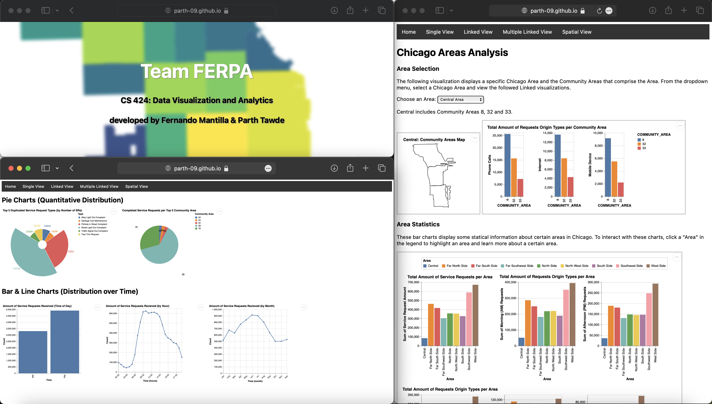
Screenshot of Web Interface

## Dataset: Chicago 311 Service Request
Link to [Dataset](https://data.cityofchicago.org/Service-Requests/311-Service-Requests/v6vf-nfxy)

Link to [Raw Dataset After Piazza Post](https://drive.google.com/file/d/1lKbnSA3wzh4s-zLISKi3PIPuVPGUIRDP/view?usp=sharing)

Link to [Deployed Website](https://parth-09.github.io/cs424-assignment4-ferpa/)

#### Overview of Development Process
All of the visualizations and work was distributed equally between Parth and Fernando. Fernando worked on task 1 where he added the Single View visualizations and worked on a heatmap for the Linked View (Task 2) visulization as well. Parth worked on Task 2 and 3 where he worked on the Linked View and Spatial View visulizations. We both collaborated and followed the driver and observer method alternatively. 

#### Introduction to Dataset
The City of Chicago has introduced a new 311 system offering improved access to the requested 311 data. The 311 system is used by citizens within Chicago to make non-emergency phone calls or requests to access a variety of city services. This dataset consists of requests created after the launch of the 311 System on December 18, 2018. There are different mediums to make 311 service requests: phone calls, internet and mobile Devices, etc. A few types of requests that could be made are Weed Removal Requests, No Water Complaints, Tree Debris Clean-Up requests, Rodent bait, and Graffiti Removal requests, to name a few.

#### **.geojson** files used to create visualizations
Gathered from the Chicago Database Website
> **Zipcode Boundaries** (boundaries-zipcode.geojson)  
> **Community Area Boundaries** (boundaries-community_area.geojson)  
> **Ward Boundaries** (boundaries-ward.geojson)  

# Implemented Visualizations and Insights

## Single View Visualizations

### Visualization 1: Distribution of Duplicate Service Requests Types

This is a radial area chart that displays the distribution of the top 5 service request types. This utilizes the SR_COUNT column developed by counting the number of SR_TYPE in the 311 dataset.

### Visualizations 2 & 3: Distribution of Completed Service Requests per Community Area & Ward

These two pie charts display the top areas (either Community Area or Ward) and their number of Completed Service Request Types. This utilizes the Count column developed by counting the number of SR_TYPE per either Community Area and Ward in the 311 dataset.
| **Visualization 2**                 | **Visualization 3**                |
| ----------------------------------- | -----------------------------------|
| 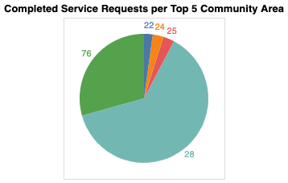         | 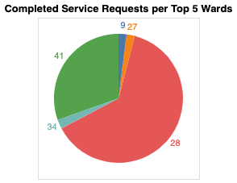        |

### Visualization 4-7: Time of Day the Most Requests are Recieved

These four line charts display the amount of Service Requests made across different time units, such as either in AM or PM (hours 0-12, 13-24, respectively), Hourly, Day of the Week and by Month. They were developed by creating smaller sub-datasets that counted the number of Service Requests depending on the respective column (CREATED_HOUR, CREATED_DAY_OF_WEEK, CREATED_MONTH and our own TIME column).

| **Visualization 4**           | **Visualization 5**           | **Visualization 6**           | **Visualization 7**           |
|-------------------------------|-------------------------------|-------------------------------|-------------------------------|
| 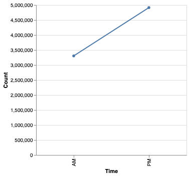       | 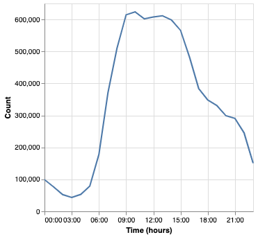       | 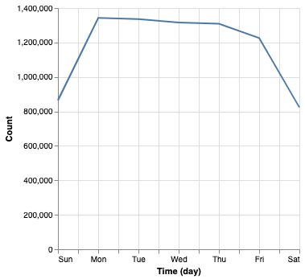       | 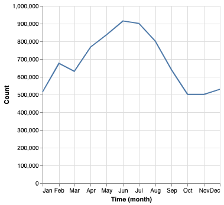       |

## Linked View Visualizations

### Linked Visualization 1
These visualizations give us an idea of the different service requests that were canceled or completed. They serve a purpose for the public to get an idea of the way 311 Services shall carry on their duties. With the number of requests canceled we see a constant line which is really close to zero. This indicates that not a lot of requests were canceled. However, with the number requests completed per derpartment we see the highest peak above 3M for 311 City Services and the second highest peak for over 2M requests for Streets and Sanitation. All these requests were completed.

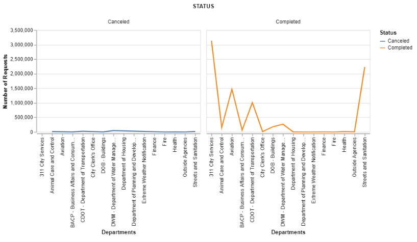

### Linked Visualization 2
The count for different Origin types per Area give a vivid distribution for people that use different mediums to make a request. It is observed that the most number of requests are made through phone calls followed by the Internet and lastly the Mobile Device. The type of Origin varies through every area but the lowest count is seen in the Central region.

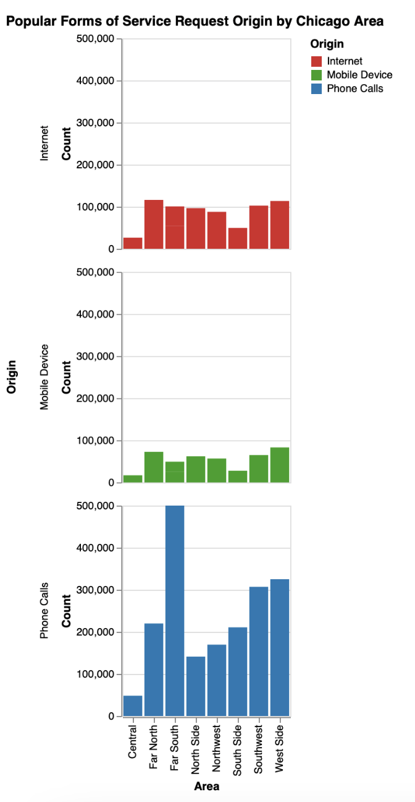

### Linked Visualization 3
Here is a scatter plot for the different types of service requests made via the citizens of Chicago and the average number of days taken by the 311 Services Department to complete it. We could see that the Tree Planting Request which is between the range of 400-450 which is the highest so far. These values are specific only to a few service request types but most requests are completed in time.

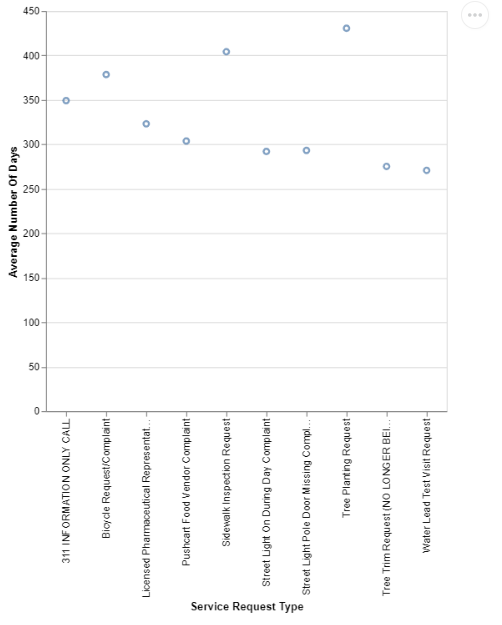

## Multiple Linked View Visualization

### Multiple Linked View Visualization 1
The following image is a varied distribution of different area associated with different requests, requests in different times of the day, and requests related to different sources of origin. These visualizations are all interactive and display the information of the Area along with the sum of different types of aggregated attributes.

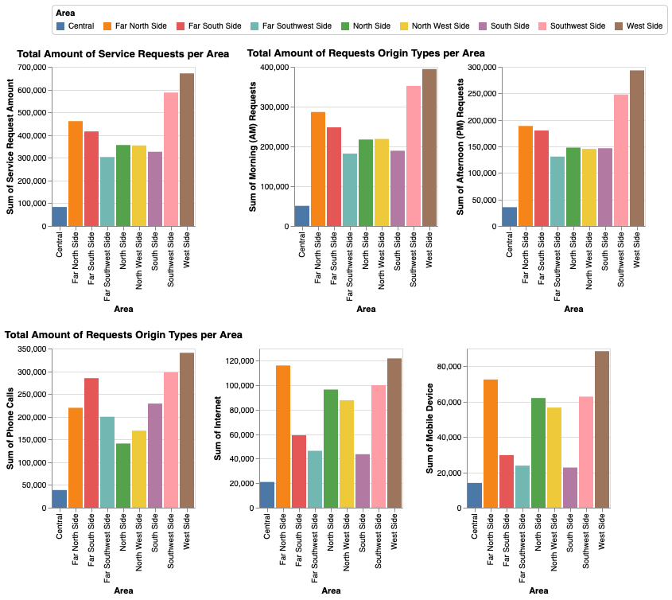

### Multiple Linked View Visualization 2
There is a dropdown menu for users to select different areas at the top of the page. The user could select an area, for example, **South Side** and it will display the total amount of request origin types per community area. It will also display the map of that area as well.

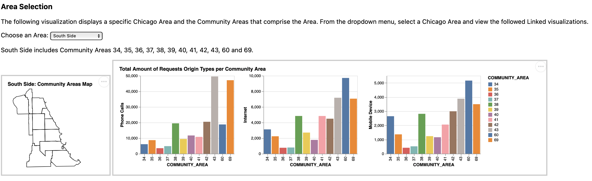

### Multiple Linked View Visualization 3
This visualization is the same as the previous one with a varied distribution but another apsect to depict the different area or location.

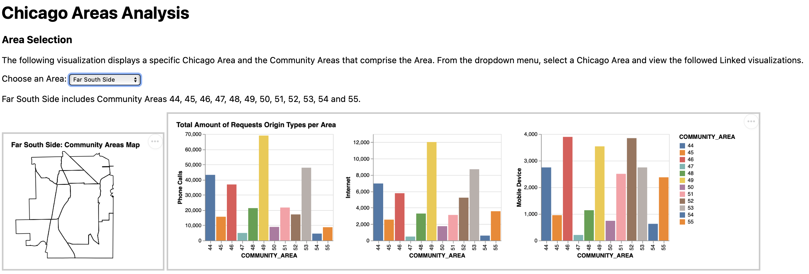

### Multiple Linked View Visualization 4
The following visualization is for Central Community areas.

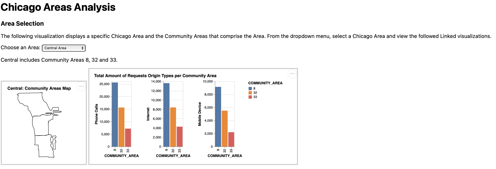

### Multiple Linked View Visualization 5
The following visulization is for searching different ward numbers and giving results based on the specific ward. For example, an input of 10 will display the number of service requests for that ward.

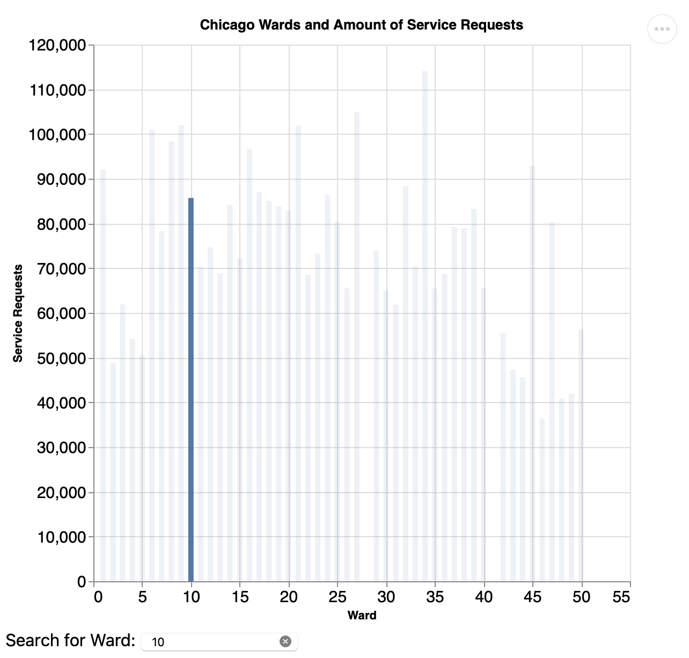

### Multiple Linked View Visualization 6
This visualization displays the number of requests for a particular zip code. For example, 60625 will display the number of service requests for that zip code.

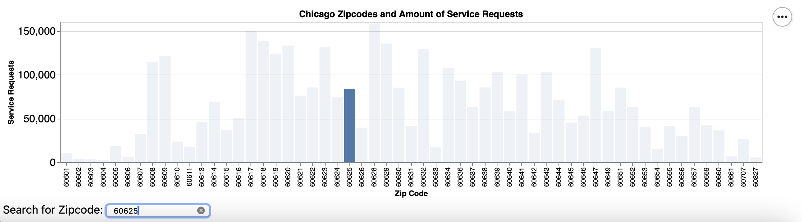

## Spatial Visualization

### Chicago Spatial Visualization

Chicago Heatmap created by counting the amount of Service Requests in each Chicago Zipcode. We created a merged geodataframe with the counts linked to zipcode property of the original **boundaries-zipcode.geojson** file from the Chicago database website and developed a linked-spatial visualization as so.

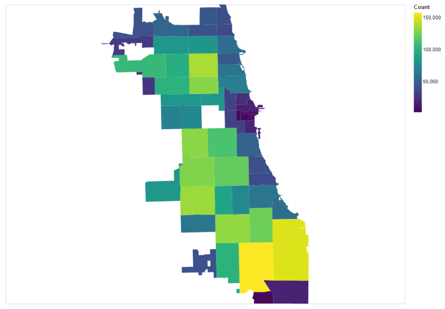

The following image depicts the interaction that one could do with the Map Of Chicago. The map is clickable and displays the Zip Code and Count for Service Requests as well as highlights the area.

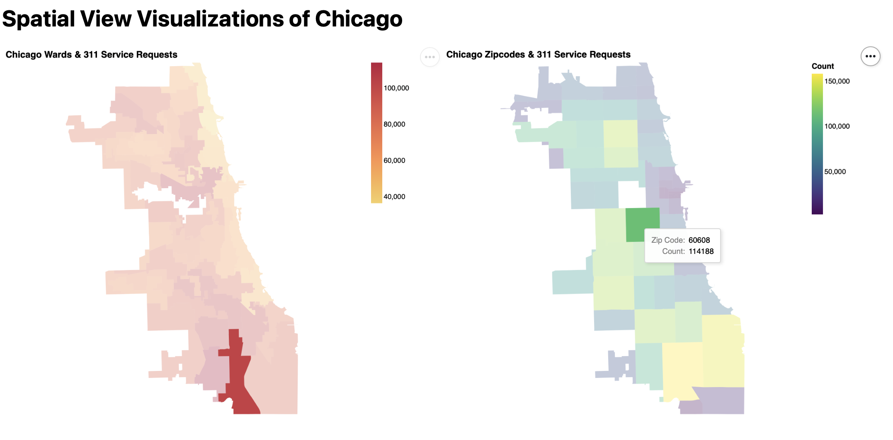
